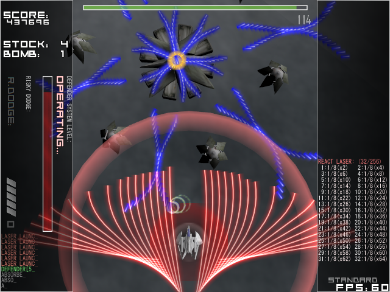
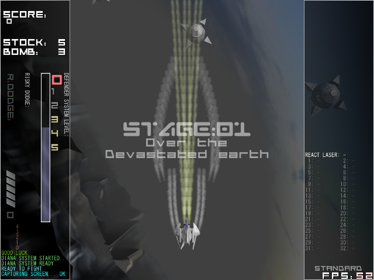
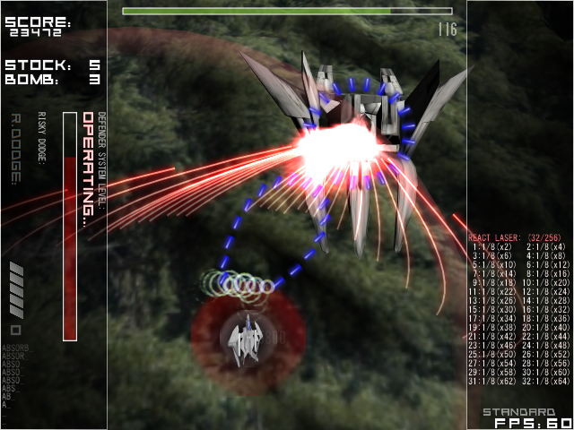
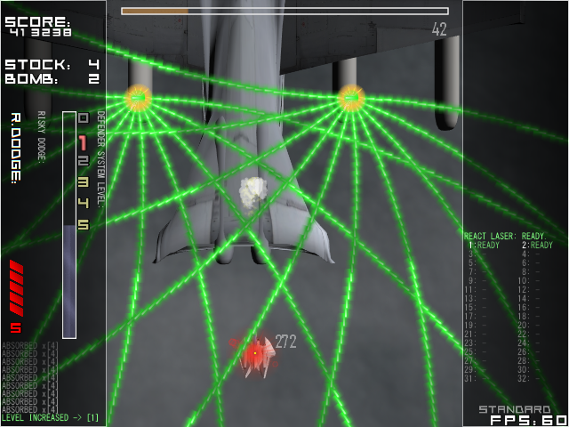

# Al-Nasl

Al-Nasl: bullet-hell vertical-scrolling shooter

In memory of a game I made about 10 years ago.  
The code is very dirty, but I wrote it when I was a C++ beginner, so please forgive me.😉

---

Al-Nasl（アル・ナスル）：弾幕系縦スクロールシューティングゲーム

10年前ぐらいに個人制作したゲームのバイナリとコードを発掘したので、
思い出として公開。  
コードがめっちゃ汚いですが、C++初心者だった頃に書いたやつなので勘弁して。

## Screenshots / スクリーンショット






## Download and install / ダウンロードとインストール

### Without source code / ソースコード無し

1. Download from [here](https://github.com/h1g0/Al-Nasl/releases).
2. Unzip
3. Run `al_nasl.exe`.
4. To uninstall, just delete the directory.

---

1. [ここ](https://github.com/h1g0/Al-Nasl/releases)からダウンロード
2. ダウンロードしたZipを解凍する。
3. `al_nasl.exe`を実行する。
4. アンインストールする場合、ディレクトリを消すだけでOK。


### With source code / ソースコード付き

```bash
git clone git@github.com:h1g0/Al-Nasl.git
```

Note: The following dependency libraries are required to build.

- [DxLib]( https://dxlib.xsrv.jp/ )
- [Boost]( https://www.boost.org/ )

## How to play / 操作

- Z key: Shoot / OK
- X key: Sub-weapon / Cancel
  - If the level of 1 or higher, the player's ship fires homing lasers. If the level is high, you can convert enemy bullets into homing lasers for a period of time. Moreover, the player's ship will be invincible at the start and end.
- C key: Bomb
  - The bomb does not damage the enemy, but it erases the enemy bullets and raises the sub-weapon level according to the amount of enemy bullets that have been erased.
- L Shift key: Slow down
  - The player's ship slows down and its shot narrows, but you can slow down enemy bullets near the player's ship.

There are 3 stages in the game.

---

- Z キー： ショット / 決定
- X キー： サブウェポン / キャンセル
  - レベルが 1 以上の場合、ホーミングレーザーを発射します。また、レベルが高ければ一定時間周囲の敵弾をホーミングレーザーに変換します。更に開始時と終了時に自機無敵が発生します。
- C キー： ボム
  - 敵にはダメージを与えませんが、敵弾を消し、消した敵弾の量に応じてサブウェポンゲージを上昇させます。
- 左 Shift： スロー
  - 自機が遅くなりショットが狭くなりますが、自機近くの敵弾を遅くすることができます。

全部で3ステージです。

## LICENSES / 使用素材等

- BGM: [Cyber-Rainforce]( https://cyber-rainforce.net/ )
- "One or more textures on this 3D model have been created with photographs from Textures.com. These photographs may not be redistributed by default; please visit www.textures.com for more information."